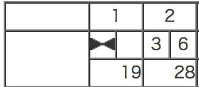
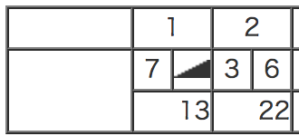
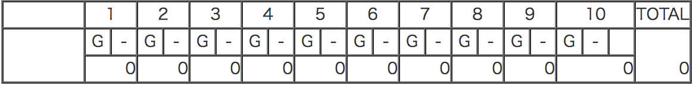
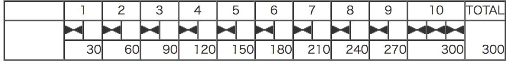

  
  
## 基本仕様
  
+ 1投目で10ピンすべて倒したら、ストライク
+ スペアは、2投目で10ピンすべて倒したということ
+ 1投目が0点で2投目で10ピン倒してもスペア
+ ガターは、1投目に横のガターに落ちて1ピンも倒せないこと
+ ボウリングでの最高得点は300点で、パーフェクトと言う
  
## ユースケース
  

  
  
### ユースケース１：ストライク
  

```javascript
```
  
### ユースケース２：スペア
  

```javascript
```
  
### ユースケース３：ガター
  

```javascript
```
  
### ユースケース４：パーフェクト
  

```javascript
```
  
  
### ユースケース５：サンプルゲーム
  

```javascript
```
  
## コアモデル
  

  
  
## 参照
  
+ [ボウリング](https://ja.wikipedia.org/wiki/%E3%83%9C%E3%82%A6%E3%83%AA%E3%83%B3%E3%82%B0 )
  